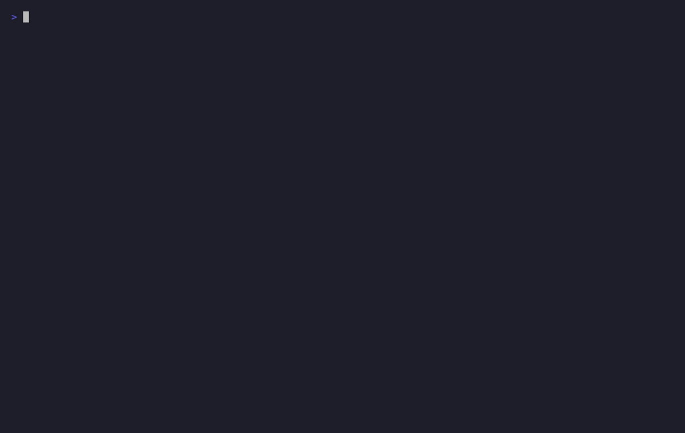

# Warden

[](LICENSE)
[](package.json)
[](https://modelcontextprotocol.io)

A sandboxed, egress-controlled MCP server. It exposes tools that let an
agent (Claude, or any MCP client) execute shell commands, but every
execution happens inside a locked-down, ephemeral Docker container instead
of on the host, with no network access by default, no secrets baked into
the image, and a full audit trail written before the command runs.

Built as a direct extension of [TIF Score MCP](https://github.com/dsvxmedia/tif-score-mcp),
the first MCP server I authored. That one exposed trusted, internal scoring
logic. This one is built for the harder case: giving an agent the ability
to run arbitrary commands, where the interesting engineering problem is
containing what happens if that ability is misused.

## Demo

Every claim below was checked against a real, running Docker container in
the same session this repo was built — not assumed working. The clip below
is real captured terminal output, not staged.



A short narrated video walkthrough (same real footage, with captions) is at
[`docs/demo/walkthrough-video.mp4`](docs/demo/walkthrough-video.mp4).

## Tools

| Tool | What it does |
|---|---|
| `run_sandboxed` | Runs a shell command inside a locked-down container and returns stdout/stderr/exit code. |
| `list_audit_log` | Returns the last N execution attempts and their results. |
| `set_egress_allowlist` | Updates which domains a sandbox may reach. Empty by default — no outbound access. |

## Setup

```bash
npm install
cp .env.example .env    # fill in sandbox image / limits, never commit this file
docker pull alpine:3.20 # or your chosen base image
npm start                # runs the MCP server over stdio
```

Register it in your MCP client config (e.g. Claude Desktop
`claude_desktop_config.json`, or a project-scoped `.mcp.json` — see this
repo's own [`.mcp.json`](.mcp.json) for a working example):

```json
{
  "mcpServers": {
    "warden": {
      "command": "node",
      "args": ["/absolute/path/to/warden/src/index.js"]
    }
  }
}
```

## Security model

Every control below is implemented in `src/sandbox.js` and `src/egress.js`,
not just described here — read those files, they're short and commented
inline with the reasoning for each flag. Every one of them was also
verified against a real running container this session; see
[Project docs](#project-docs) below for the evidence and the two real bugs
that verification actually found and fixed.

- **No network by default.** A sandbox can't exfiltrate data or call out
  to an attacker-controlled host unless a network mode is explicitly
  requested, and even then only through a domain allowlist.
- **Non-root, capabilities dropped.** Runs as UID 1000 with
  `--cap-drop=ALL` and `--security-opt=no-new-privileges`. A compromised
  process inside the sandbox has no privileged Linux capabilities to
  escalate with.
- **Read-only root filesystem.** Only a 64MB tmpfs scratch directory is
  writable. Nothing persists past the container's lifetime.
- **Resource limits.** Memory, CPU, and PID caps prevent a runaway or
  fork-bombing process from affecting the host. Memory-swap is pinned equal
  to the memory limit, so there's no implicit 2x headroom from Docker's
  default swap behavior.
- **Hard timeout.** A wall-clock kill switch independent of the process's
  own behavior — the container is force-stopped by name, not just the
  local `docker` client process, since a killed client doesn't otherwise
  guarantee the container stops.
- **Secrets never touch the image.** All configuration (sandbox image
  name, resource limits, timeout) comes from environment variables via
  `.env`, which is gitignored. Nothing is hardcoded, nothing is logged.
- **Audit-before-execute.** Every call to `run_sandboxed` is logged with
  its full parameters *before* the container starts, so a killed or
  crashed sandbox still leaves a record of what was attempted — the same
  gate-before-action pattern used in production TCS agents, applied here
  at the sandbox-execution layer.

## Tradeoffs (the buy-vs-build reasoning)

**Why Docker isolation and not a microVM (Firecracker, gVisor)?**

Docker's isolation is namespace- and cgroup-based: it shares the host
kernel. A microVM sandbox (Firecracker, as used by AWS Lambda and
Fly.io; gVisor, used by Google Cloud Run) runs a minimal guest kernel
per sandbox, which closes off an entire class of kernel-exploit escapes
that Docker isolation doesn't.

For this project, Docker was the right call, not because it's equally
safe, but because the threat model is bounded: this isn't running
arbitrary untrusted code from the public internet at scale, it's running
agent-requested commands in a controlled, single-operator context, where
the combination of no-network-by-default + dropped capabilities +
read-only filesystem + resource limits closes the realistic attack
surface for that context. Reaching for Firecracker here would be solving
a problem this deployment doesn't have yet, at real cost in setup and
operational complexity.

The kill criterion for that decision: if this ever ran commands from
untrusted, external, internet-facing input instead of a single operator's
own agent, that's the point where the extra week for a microVM layer
becomes worth spending, and I'd revisit this file and swap the isolation
layer rather than patch around it.

## Not yet built (documented honestly, not hidden)

- The egress allowlist is stored and served to `warden-cli allowlist`,
  but the actual iptables/proxy enforcement on the `warden-egress` Docker
  network is not wired up yet — this is the next real piece of work, not
  a finished control.
- No persistent identity/auth layer on the MCP server itself; it assumes
  a trusted local MCP client (Claude Code/Desktop), the same trust
  boundary as `tif-score-mcp`.

## CLI

```bash
node cli/warden-cli.js status       # list running sandboxes
node cli/warden-cli.js logs 50      # last 50 audit log entries
node cli/warden-cli.js kill <id>    # force-kill a running sandbox
node cli/warden-cli.js allowlist    # show current egress allowlist
```

## Project docs

Everything from the verification session that built and hardened this
repo — nothing summarized away:

- [`docs/BEHIND_THE_SCENES.pdf`](docs/BEHIND_THE_SCENES.pdf) — the full
  build story, plain language, plan to finish.
- [`docs/learning/`](docs/learning/) — technical write-ups of every real bug
  verification found: a container-leak on timeout, an implicit 2x
  memory-swap headroom, and a follow-up adversarial pressure-test pass
  (fork bombs, corrupted logs, unbounded stdout, misreported containers)
  that found and fixed four more, all with before/after evidence.
- [`docs/evidence/`](docs/evidence/) — raw captured command output backing
  every claim above.
- [`docs/plan/PLAN.md`](docs/plan/PLAN.md) — the plan this session was
  executed against.
- [`docs/skills-used/`](docs/skills-used/) — what built this, and how.
- [`scripts/`](scripts/) — the standalone verification scripts themselves;
  rerun them yourself against your own Docker daemon.

## Stack

Node.js, `@modelcontextprotocol/sdk`, Zod, Docker CLI (invoked via
`child_process`, no Docker Engine API dependency).
